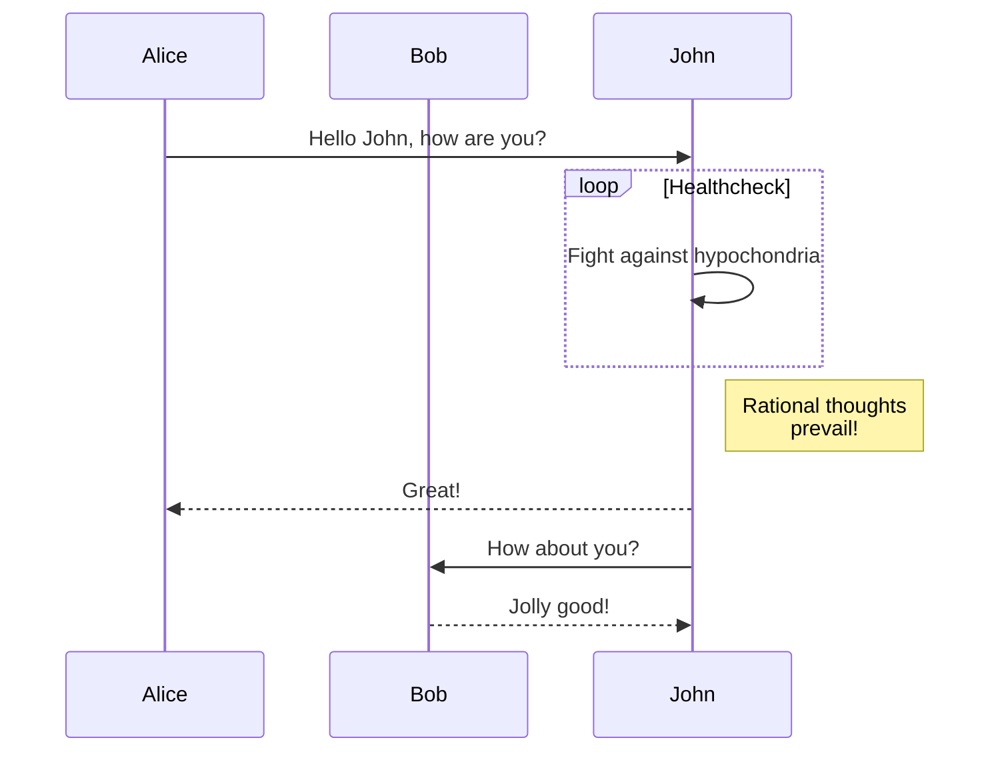
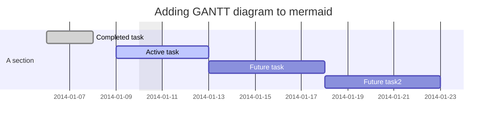

# README
README

## Start
`go env -w GOPROXY=https://goproxy.cn,direct`

`go mod tidy`

## demo

### katex
`$...$`
∪$\cup$`\cup`

`$$...$$`

$$
\cup
$$

$$
  \begin{align}
  D(x) &= \int_{x_0}^x P(x^{\prime})\,\mathrm{dx^{\prime}}  \\
  &= C\int_{x_0}^x x^{\prime n}\,\mathrm{dx^{\prime}} \\
  &= \frac{C}{n+1}(x^{n+1}-x_0^{n+1}) \\
  &\equiv  y
  \end{align}
$$

matrix

$$
\begin{matrix}
    1&x&x^2\\
    1&y&y^2\\
    1&z&z^2\\
\end{matrix}
$$

### mermaid

Sequence diagram

Gantt diagram

